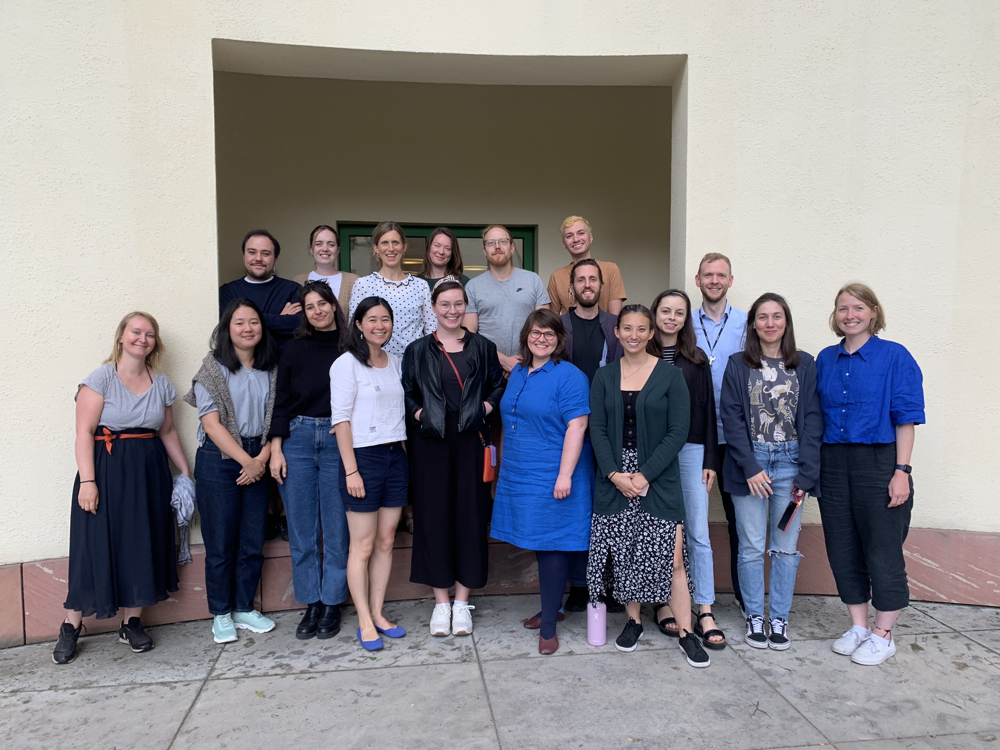

# SICSS 2023 Berlin

The Summer Institute will be held at the [Berlin Social Science Center (WZB)](https://www.wzb.eu).

Find further information about the key note speakers and their talks on our [speakers page](https://www.wzb.eu/en/research/dynamics-of-social-inequalities/work-family-and-social-inequality/sicss-2023).

---

## Week 1

|             | Monday (7/3)               | Tuesday (7/4)                 | Wednesday (7/5)            | Thursday (7/6)         | Friday (7/7)                   |
| ----------- | -------------------------- | ----------------------------- | -------------------------- | ---------------------- | ------------------------------ |
| 9.00-10.30  | Introduction               | Collecting digital trace data | Data cleanup               | Text Analysis I        | Text Analysis II               |
| Room:       | B002                       | B002                          | B002                       | B001                   | B002                           |
| 10.30-11.00 | Coffee break               | Coffee break                  | Coffee break               | Coffee break           | Coffee break                   |
| 11.00-12.30 | Collaborating using Git    | Exercise                      | Exercise                   | Exercise               | Exercise                       |
| Room:       | B002                       | B001/B002                     | B002/Wintergarten          | B001/B002              | B001/B002                      |
| 12.30-13.30 | Lunch break                | Lunch break                   | Lunch break                | Lunch break            | Lunch break                    |
| 13.30-14.45 | Ethics                     | Exercise                      | Exercise                   | Exercise               | Speaker: Christian Rau         |
| Room:       | A310                       | B001/B002                     | B002/Wintergarten          | B001/Wintergarten      | A310                           |
| 14.45-15.00 | Coffee break               | Coffee break                  | Coffee break               | Coffee break           | Coffee break                   |
| 15.00-16.30 | Speaker: Helena Mihaljevic | Speaker: Elizabeth Bruch      | Speaker: Sebastian Zezulka | Speaker: Sophia Hunger | Group projects (finding teams) |
| Room:       | A310                       | A310                          | A310                       | B001                   | B002                           |
| 16.30 +     | Welcome dinner: Pizza      |                               |                            |                        |                                |

---

## Week 2

|             | Monday (7/10)          | Tuesday (7/11)         | Wednesday (7/12)       | Thursday (7/13)                      |
| ----------- | ---------------------- | ---------------------- | ---------------------- | ------------------------------------ |
| 9.00-9.30   | Project status update  | Project status update  | Project status update  | Project presentations and discussion |
| Room:       | B002                   | B002                   | B002                   | B002                                 |
| 9.30-12.30  | Work on group projects | Work on group projects | Work on group projects | Project presentations and discussion |
| Room:       | B001/B002              | B001/B002              | B001/B002              | B002                                 |
| 12.30-13.30 | Lunch break            | Lunch break            | Lunch break            | Lunch break                          |
| 13.30-15.30 | Work on group projects | Work on group projects | Work on group projects | Project presentations and discussion |
| Room:       | B001/B002              | B001/B002              | B001/B002              | B002                                 |
| 15.30-16.30 | Project status update  | Project status update  | Project status update  | Project presentations and discussion |
| Room:       | B002                   | B002                   | B002                   | B002                                 |
| 16.30 +     |                        |                        | Farewell dinner        |                                      |