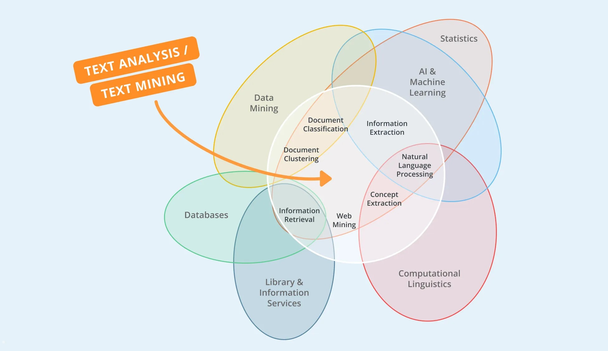
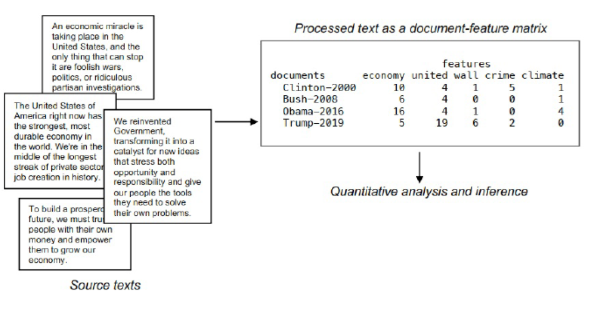
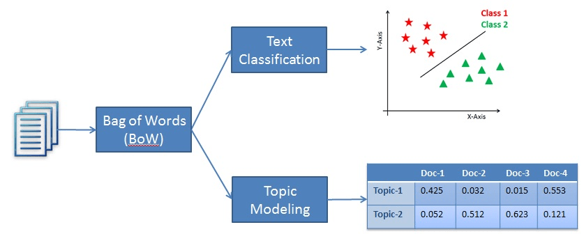

# Text analysis I
## Frequency based methods  

---




# Introduction

* goal of text analysis: **deriving meaningful insights from textual data**

* text as an artifact of social and political interaction
* increasing availability and digitization of diverse texts <br>  (parliamentary debates, newspaper articles, archives, social media)
* texts are used to communicate, so they always contain information
* we can understand this information as data, even if this is not the main intention of the communication
* transform text to data points to analyze and extract information/content
* **BUT:** this transformation always leads to simplifications and truncations


# Text as data workflow

1. Acquiring text $\checkmark$
2. Transform text to (numerical) data
3. Pre-process data 
4. Analyse data
5. Validate and interprete results


# Text as data specifics

Challenges of Text as data compared to conventional structured data:
- no clear workflow 
- data, pre-processing, methods and models vary strongly on research question
- specifics for different languages, e.g. for pre-processing
- get used to the data: look for errors, word combinations, specialties
- much more back and forth; check text and results for inconsitencies
- many decisions on the way: theory, compare, check!

$\rightarrow$ much more explorative, qualitative understanding of text specifity


# Bag of Words

- computers and ML algorithms need (vectors of) numbers
- transforms raw text into numbers -> *vectorization* or *feature encoding*
- results in *document-feature matrix*
- collection of terms and their frequencies per document
- disregards grammar, word order, and context
- simple, but easy and useful starting point for many NLP tasks

---


---




# Bag of **Words?**

What is the smallest, meaningful unit of text documents to encode?

- words
- terms
- features
- tokens
- types
- n-grams
- emojis
- hashtags
- punctuation


# Bag of **Questions I**

1. What are the rows of a DFM?
2. What are the dimensions of an DFM?
3. What are the benefits of BOW approach?
4. What are the shortcomings of BOW approach?


# Bag of **Pre-processing**

manipulate and simplify raw text data to focus on important information:

* remove punctuation? numbers? symbols? separators?
* remove stopwords?
* cases to lower?
* stemming?
* lemmatization?
* n-grams?
* min/max occurrence?

---

"Our first claim is that while theory should guide our preprocessing choices, __in practice, there is little concrete guidance for those embarking on an unsupervised analysis of a fresh dataset.__ Second, those __choices are consequential for the inferences that can be made__ in terms of both substance and model fit."

*Denny & Spirling 2017*


# Bag of **N-grams**

- which words appear often together
- keep (important) compound words together and ordered:
	- names, e.g. United States
	- negatiations, e.g. not bad
	- intensifiers, e.g. very good
- keep at least some word relations/order
- usually bi-grams (2), but also 3 or 4 possible


# Bag of **TF-IDF**

- scoring approach: relevance of token in a document (not just counts)
- weighting: penalize words, that are frequent across all documents

- **term frequency**: relative frequencie of term in current document
- **inverse document frequency**: how rare is the word across all documents

$\mathrm {tfidf} (t,d,D)= \mathrm {tf} (t,d)\cdot \mathrm {idf} (t,D)$
$\mathrm {tf}(t,d)={\frac {f_{t,d}}{\sum _{t'\in d}{f_{t',d}}}}$
$\mathrm{idf}(t, D) = \log \frac{N}{|\{d \in D: t \in d\}|}$


# Bag of **TF-IDF example**

- given 100 news paper articls, with 1000 words each
- the first article includes the word 'criminal' 16 times 
- over all 'criminal' appears in 40 articles

*tf*: 16/1000 = 0.016
*idf*: log(100/40) = 0.916

*tf-idf*: 0.16 x 0.916 = 0.0147

if 'criminal' appears ...
... 100 times in the first article: 0.0916
... in just 15 articles: 0.0304


# Bag of **Questions II**

1. In what cases should we not remove all stopwords? 
2. Which punctuations can be informative?
3. Should we add all possible n-grams?
4. When is a TF-IDF not helpfull?

<!---
when the specific stopwords carry important semantic or contextual meaning in the analysis task. For example, in sentiment analysis, words like "not" or "but" are crucial in determining the sentiment polarity.

Punctuations such as question marks, exclamation marks, or quotation marks can be informative in text analysis. They can provide insights into the sentiment, emphasis, or intent of the text, especially in tasks like sentiment analysis or emotion detection.

Adding all possible n-grams is not advisable in most cases as it can lead to a significant increase in feature space and computational complexity. It's recommended to consider a subset of relevant n-grams based on the specific task and domain knowledge.

TF-IDF may not be helpful in cases where the document collection is small or lacks diversity. In such situations, the term frequency (TF) component may dominate and not adequately capture the importance of terms. Additionally, TF-IDF may not be suitable for tasks where the order of words matters significantly, such as in language generation or sequential prediction tasks.
--->

# Bag of **Analysis**

* (compare) term frequencies & keyness $\rightarrow$ exploration
* readability & lexical diversity
* sentiment analysis (e.g. dictionary approaches)
* document classification (e.g. naive bayes, support vector machine)
* topic modeling (e.g. LDA, STM)


# Bag of **R packages**

Frameworks to manage and analyze text data
- [quanteda](dahttps://quanteda.io/): Quantitative Analysis of Textual Data
- [tidytext](https://www.tidytextmining.com/): Text mining using dplyr, ggplot2, and other tidy tools
- [text2vec](https://text2vec.org/): Efficient framework with a concise API for text analysis and NLP
- [tm](https://tm.r-forge.r-project.org/): Text Mining Infrastructure in R
- [spacyr](https://spacyr.quanteda.io/articles/using_spacyr.html): Wrapper for Python library spacy for advanced NLP and ML 

... and many more for special tasks (on [CRAN](https://cran.r-project.org/web/views/NaturalLanguageProcessing.html))

<!--
show NLP R ecosystem
-->

# Bag of **Quanteda**

  - package for **qu**antitative **an**alysis of **te**xtual **da**ta
    - 2013 first published 
    - broadly used, often in social science
  - faster then comparable R packages (tm, tidytext)
  - implements a lot of standard methods
  - functional for most languages, also for non-latin characters
  - compatible with other packauges: spacyr, readtext, stm, ...
  - multiple packages: *quanteda*, *quanteda.textstats*, *quanteda.textmodels*, *quanteda....*


# Bag of **Workflow**

Three different data levels and objects:

1. **Corpus**: data.frame of structured texts with document variables
2. **Tokens**: splitted text,stay in order of original text
3. **Document-feature matrix**: matrix with frequencies of tokens per document

---

## Create base objects

1. Corpus
```r
corpus <- corpus(textdata, text_field = "body") 
```

2. Tokenization
```r
tokens <- tokens(corpus, what = "word") # "sentence", "character", ...
```

3. Document-feature matrix
```r
dfm <- dfm(tokens)
```
---

## Pre-processing of tokens

```r
tokens_pp <- tokens(
    corpus,
    what = "word",
    remove_punct = TRUE,
    remove_symbols = TRUE,
    remove_numbers = TRUE,
    remove_separators = TRUE
  ) |>
  tokens_tolower() |>
  tokens_wordstem(language = "en") |>
  tokens_remove(stopwords("en"), padding = TRUE)
```

---

## DFM manipulation

- dfm_subset : subset based on document variables
- dfm_select/remove/keep : subset based on document features
- dfm_tolower/toupper/stem : change case of features
- dfm_group : grouping based on document variables
- dfm_weight/tfidf : dfm weighting
- dfm_lookup : use of dictionaries

and also multiple functions for *tokens_* and *corpus_* 

---

## Keywords, tf-idf, and keyness

```r
topfeatures(dfm, 10)
textstat_frequency(dfm, n = 10)
```

```r
dfm_tfidf <- dfm_tfidf(dfm)
topfeatures(tfidf, n = 5, groups = docnames(tfidf))
```

```r
textstat_keyness(dfm, target = docvars(dfm, "news") == "CNN") |>
  textplot_keyness()
```

---

## Context, n-grams, and feature co-occurrence matrix

```r
kwic(tokens_pp, "rezensent*")
```

```r
textstat_collocations(tokens_pp, size = 10)
```

```r
tokens_pp <- tokens_compound(tokens_pp, pattern = phrase("black live matter"))
```

```r
fcm_pp <- fcm(tokens_pp, context = "window", count = "frequency", window = 3)
topfeatures(fcm_pp)
```

---


# Sentiment analysis: **Dictionary**

* list of keywords for broader concept/categories
* measurement: lookup keywords $\rightarrow$ count/proportion of appearance
* use existing dictionary or create your own 
* advantages: easy to use and to understand
* disadvantages: Pre-made dictionaries might not fit your textual data, creating your own dictionary is a lot of work

---


# Sentiment analysis: **Quanteda**

[Quanteda sentiment dictionaries](https://github.com/quanteda/quanteda.sentiment)

```r
library(qanteda.sentiment) 
library(quanteda.textstats)

dict_pol <- data_dictionary_HuLiu

dfm_lookup(dfm_pp, dict_pol)

textstat_polarity(dfm_pp, dict_pol)

textstat_valence(dfm_pp, data_dictionary_AFINN)
```


# Topic modeling: **LDA**

* what is a text about? how do the topics differ over time? between texts?
* 'topic' is characterised by a set of high probability co-occurring words
* topic modeling do not require any labeling of the documents (unsupervised) <br> $\rightarrow$ topics emerge from the methodology and the corpus
* number of topics set by researcher $\rightarrow$ degree of granularity
* two outputs: words per topics, topics per document
* LDA (Latent Dirichlet allocation) most frequently used
* LDA assumes documents a mixture over topics and topics a mixture over words

<!--
- topics: list of words that co-occurre often 
- words with high propabilty of being part of one topic
- words can be in multiple topics
- each document mixture of different topics
- topic models are mixture models where most documents have some resemblence to each topic

- Topic models tend to produce the best results when applied to texts that are not too short (such as tweets), and those that have a consistent structure
- To begin, the term “topic” is somewhat ambigious, and by now it is perhaps clear that topic models will not produce highly nuanced classification of texts. Second, topic models can easily be abused if they are wrongly understood as an objective representation of the meaning of a text.
- 

- algorithm -> iterative bayesian process: from randomly assigned propabilitys to best fit

Each word that appears in the corpus is randomly assigned to one of the k topics. If you are a stickler for the details, this assignment is technically not random, since it involves a Dirichlet distribution that employs a probability simplex instead of real numbers (this simply means that the numbers assigned across the k topics add up to 1)

Topic assignments for each word are updated in an iterative fashion by updating the prevalence of the word across the k topics, as well as the prevalence of the topics in the document. This stage of LDA employs the Term Frequency-Inverse Document Frequency metric discussed in a previous tutorial. Topic assignments are updated up to a user-specified threshold, or when iterations begin to have little impact on the probabilities assigned to each word in the corpus.


[tutorial here!](https://cbail.github.io/SICSS_Topic_Modeling.html)
-->

---


[David Blei (2012): Probabilistic topic models](https://www.cs.columbia.edu/~blei/papers/Blei2012.pdf)


# Topic modeling: **Example**

[Poster](https://martinmolder.com/wp-content/uploads/2018/03/poster_20170219.jpg) by Martin Mölder & Federico Vegetti
https://martinmolder.com/various/punk-songs/


# Topic modeling: **Quanteda**

```r
library(quanteda.textmodels)
library(seededlda)

tmod_lda <- textmodel_lda(dfm_pp, k = 3)

terms(tmod_lda, 10)

topics(tmod_lda)
```

---



<!--
- difference in category
-->

# Classifier: **General**

* algorithms that are used to classify text into predefined categories or classes
* different methods: *Naive Bayes*, *SVM*, *Random Forest*, *K-nearest neighbors*
* learning patterns from input to make predictions about the category of unseen text
* part of text data needs to be (manually) labeld (supervised)
* split data in **training** and **test** set
* metrics to evaluate: *confusion matrix*, *accuracy*, *precision*, *recall*, *F1 score*


<!--
Confusion Matrix: table that summarizes the performance of a classification model. It displays the counts of true positive (TP), true negative (TN), false positive (FP), and false negative (FN) predictions made by the model.

Accuracy: measures the overall correctness of a classification model. It is calculated by dividing the number of correctly classified samples (TP and TN) by the total number of samples. Accuracy provides an overall view of the model's performance but may not be sufficient when the classes are imbalanced.

Precision: quantifies the proportion of correctly predicted positive samples (TP) out of all samples predicted as positive (TP and FP). It focuses on the model's ability to avoid false positives and is particularly useful when the cost of false positives is high.
TP / (TP + FP)

Recall: also known as sensitivity or true positive rate, measures the proportion of correctly predicted positive samples (TP) out of all actual positive samples (TP and FN). It captures the model's ability to identify positive samples and is useful when the cost of false negatives is high.
TP / (TP + FN)

F1 Score: combines precision and recall into a single value. It is the harmonic mean of precision and recall, providing a balanced evaluation of the model's performance. The F1 score considers both false positives and false negatives and is particularly useful when classes are imbalanced.
2 * (Precision * Recall) / (Precision + Recall)
-->

# Classifier: **Naive Bayes**

- counting co-occurrence of features with each class is main learning idea
- probabilistic algorithm based on Bayes' theorem
- assumes that the features are conditionally independent $\rightarrow$ "naive"
&nbsp;
1. estimate the probabilities for each feature occurring given a (training) class
2. calculates the probability of each class given the input features <br> $\rightarrow$ selects class with highest probability for (unseen data)

<!--
- classic classifier works good with small corpus (compared to deep learning)
- classifiers often perform well and are computationally efficient, making them suitable for large-scale applications
- need less labeld data
-->

# Classifier: **Quanteda**

```r
library(quanteda.textmodels)

tmod_nb <- textmodel_nb(dfmat_train, class)

summary(tmod_nb)

predicted_class <- predict(tmod_nb, dfmat_test, force = TRUE)

tab_class <- table(class, predicted_class)
caret::confusionMatrix(tab_class, mode = "everything")
```


# Exercise I

1. load and inspect the whole corpus (documents, dimensions, tokens, types)
2. use different pre-processing strategies and compare results
3. show most important compound and co-occuring words
4. extract important keywords
5. Bonus: check, if keywords differ over time and between groups <br> (e.g. newspaper, authors gender, division, ...)


# Exercise II

Decide as team which task you want to start with:
1. dictionary: sentiment over time, grouped by newspaper
Are there differences using TF-IDF? Why? Try different Dictionaries.
2. topic modeling: find topics and show how they appear in the corpus
3. Bonus: try the seeded LDA or stm topic modeling approach