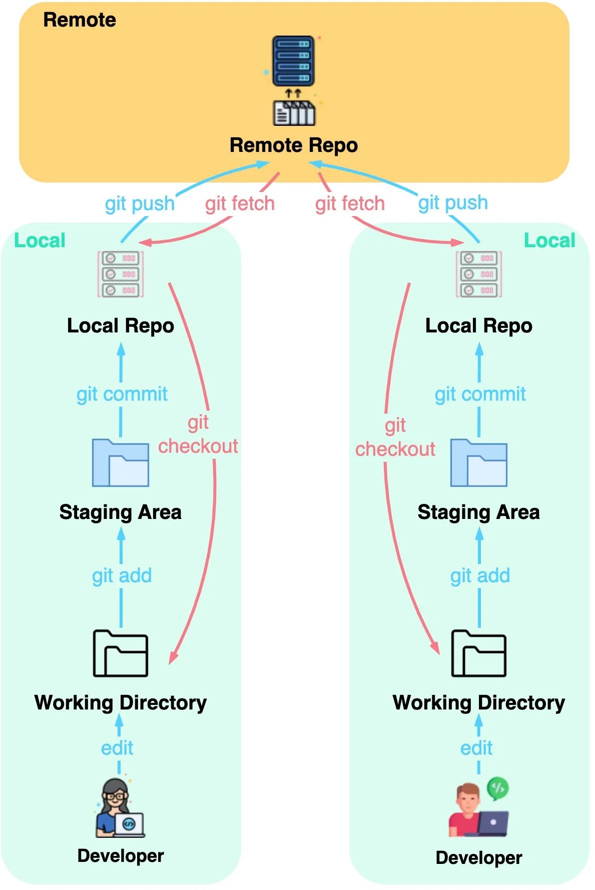

<!-- headingDivider: 1 -->

# Introduction to Workflow and Git(Hub)


# Folder and file structure

1. separate folders for scripts, data, output, and reports
2. raw data files separate from processed data
3. clear and consistent names for script and output files
4. numbering, lowercase, and separate words with underscores or hyphens
5. if date necessary, usually in the end, sort by YYYYMMDD
6. multiple script files for different (sub) tasks (max 100 lines)


# Efficient R scripts

1. define libraries, default variables, source code at top of script
2. comment and structure sections (# ---- headline ----)
3. use pipe operator |> (magritter: %>%) for combining functions
4. use indentations and spaces for readability
5. [DRY](https://en.wikipedia.org/wiki/Don%27t_repeat_yourself) - use loops, vectorization and functions
6. use relative paths for data and output
7. use lists and lapply for iterations
8.  avoid hard coded subsetting and indexing


# Best practice ressources

- [Best Coding Practices for R](https://bookdown.org/content/d1e53ac9-28ce-472f-bc2c-f499f18264a3/folder.html)
- [Structuring R projects](https://www.r-bloggers.com/2018/08/structuring-r-projects/)
- [R Best Practices](https://kdestasio.github.io/post/r_best_practices/)
- [Tips for organising your R code](https://www.r-bloggers.com/2023/01/tips-for-organising-your-r-code/)
- [Nice R Code](https://nicercode.github.io/)
- [Repeating things: looping and the apply family](https://nicercode.github.io/guides/repeating-things/)


# Git: **Idea and concept**


- distributed version control system
- track and document changes in code
- compare and find differences
- "time travel maschine"
- helps to imagen changes as smaller tasks
- share, publish, and collaborate on projects


# Git: **First and basic steps**



```
$ git config --global user.name <your name>
$ git init <your repository name>
$ git status

$ git add <file-name-1> <file-name-2>
$ git commit -m “<commit-message>”
OR BOTH IN ONE
$ git commit -am “<commit-message>”
```

# GitHub: **Remote and cooperative workflow**

```
$ git clone <git-repo-url>

$ git branch < branch-name>
$ git checkout <name-of-your-branch>
OR BOTH IN ONE
$ git checkout -b <name-of-your-branch>

$ git push -u (<remote> OR origin) <branch-name> 

& git fetch
& git merge <branch-name>
OR BOTH IN ONE
$ git pull <remote> (<branch-name>)

$ git fork 
```
---


# GitHub: **.gitignore**

**Why:** text file with folders and files (patterns) not to track

**What:** sensitive data; temp and old files; big data files; outputs
  -> usually track just plain text files (e.g. R scripts, TeX source, etc.) 

**How:** 2 approaches ([helpful online tool creates content automatically](https://www.toptal.com/developers/gitignore))

```
/data/old
passworts.txt
*.doc
------OR------
/*
!.gitignore
!/scripts


# Git: **Ressources**

- [Intro to Git, for the Social Scientist](https://www.nimirea.com/blog/2019/05/10/git-for-social-scientists/)
- [Git for Social Scientists](https://jortdevreeze.com/en/blog/how-git-can-make-you-a-more-effective-social-scientist/)
- [Git for Students in the Social Sciences](https://www.shirokuriwaki.com/programming/kuriwaki_github_handout.pdf)
- [GitHub - The Perks of Collaboration](https://cosimameyer.com/post/git-the-perks-of-collaboration-and-version-control/)
- [AI tool suggesting git command](https://www.gitfluence.com/)
```


# Code Editor: **VSCode**


# Code Editor: **Benefits**

- swiss army knive of coding and file management
  - search (and replace) in whole project folder
  - side-by-side editor windows
  - better file and folder managment
  - customizable (with extensions)
- multiple languages supported (e.g. R, Python, LaTeX, Markdown)
- Git(Hub): easy integration for better workflow
- with R:
  - run multiple R Sessions in parallel
  - script still editeble if process busy


# Code Editor: **Ressources**

- https://code.visualstudio.com/docs/languages/r
- https://renkun.me/2019/12/11/writing-r-in-vscode-a-fresh-start/
- https://schiff.co.nz/blog/r-and-vscode/
- https://rolkra.github.io/R-VSCode/


# GitHub: **Course material**


1. install git
2. create a GitHub account
3. clone our course material [**repository**](https://www.github.com/StefanMunnes/SICSS_Berlin_2023)
4. add a personal folder in the local repo
5. push this change to the remote repository
6. fetch changes of the other participants
