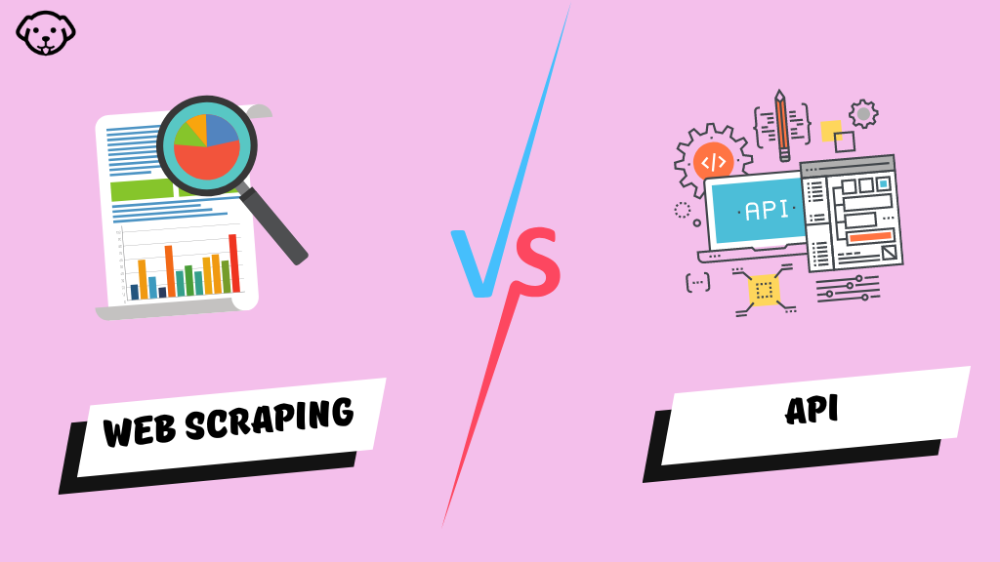

# Digital trace data

---

# Web scraping

- extract large amount of (semi) structured data from webpages


Problems:
- Robot detection
  - change IP, random time delay between responses
- ban on IP
- dynamic content
- pagination
- CAPTCHAs (reverse turing test)
- cryptic URLs

---

# API: Concept

- "Application Programming Interface" 
  - computer-optimized access to structured data basis for automatic workflow
- usually 
- [GitHub: public APIs](https://github.com/public-apis/public-apis)
- [Any API](https://any-api.com/)


api.genderize.io

---

# API: R Workflow


1. GET: request to API URL, receive response code and structured data
2. parse (from response format to data structure)
3. 


The key features of any API are the structure of the requests and the structure of the responses. An HTTP request consists of the following parts:

HTTP verb (GET, POST, DELETE, etc.)
The base URL for the API
The URL path or endpoint
URL query arguments (e.g., ?foo=bar)
Optional headers
An optional request body

In response to this request, the API will return an HTTP response that includes:

  An HTTP status code.
  Headers, key-value pairs.
  A body typically consisting of XML, JSON, plain text, HTML, or some kind of binary representation.

---

# API: Authentication

GET("http://httpbin.org", authenticate("username", "password")

key or token

part of URL

---

# Best practices: credentials

Never save private data in script files, specially when using GitHub, instead:

```r
# keys.R (save anywhere)
pw <- "my password"
 
# script.R
source("keys.R")
login(password = pw)
```
or
```r
# ~/.Renviron or Projectfolder/.Renviron
pw = "my password"
 
# script.R
login(password = Sys.getenv("pw"))
```

---



---

|                      | **Web Scraping**              | **API**                  |
| -------------------- | :---------------------------- | :----------------------- |
| Data Consistency     | Inconsistent data extraction  | Structured data          |
| Data Format          | Additional processing         | Predefined format        |
| Access Restrictions  | CAPTCHAs, IP blocking         | Authorized access        |
| Legal Considerations | Potential legal concerns      | Terms of service         |
| Development Effort   | Custom code development       | API integration          |
| Speed                | Dependent on website response | Optimized data retrieval |
| Reliability          | Subject to website changes    | Reliable data source     |

---

# API downfall?

- large language models extrem valuebal, but relay on huge amount of text data
- more and more companies restrict and monetize the access to "their" data
- even for researchers nearly impossible to receive important data
[Twitter](https://mashable.com/article/twitter-elon-musk-paid-enterprise-api-access-pricing)
[Reddit](https://www.theguardian.com/technology/2023/jun/14/reddit-moderators-vow-to-continue-blackout-in-api-access-fees-row)