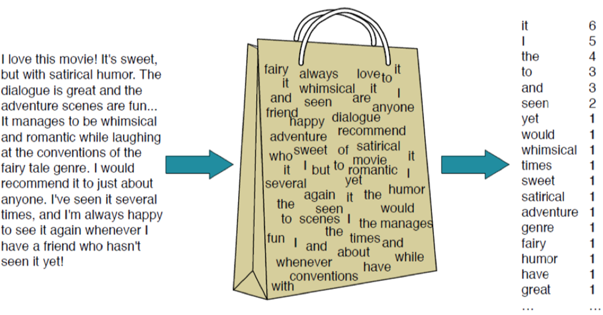
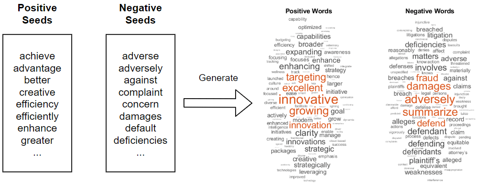

# Text analysis I
## Frequency based methods  

---


# Introduction

- goal of text analysis: **deriving meaningful insights from textual data**

- text as an artifact of social and political interaction
- increasing availability and digitization of diverse texts
  (parliamentary debates, newspaper articles, archives, social media)
- texts are used to communicate, so they always contain information
- we can understand this information as data, even if this is not the main intention of the communication
- transform text to data points to analyze and extract information/content
- **BUT:** this transformation always leads to simplifications and truncations


# Text as data workflow

1. Acquiring text $\checkmark$
2. Transform text to (numerical) data
3. Pre-process data 
4. Analyse data
5. Validate and interprete results


# Text as data specifics

Challenges of Text as data compared to conventional structured data:
- no clear workflow 
- data, pre-processing, methods and models vary strongly on research question
- specifics for different languages, e.g. for pre-processing
- get used to the data: look for errors, word combinations, specialties
- much more back and forth; check text and results for inconsitencies
- many decisions on the way: theory, compare, check!

$\rightarrow$ much more explorative, qualitative understanding of text specifity


# Bag of Words

- computers and ML algorithms need (vectors of) numbers
- transforms raw text into numbers -> *vectorization* or *feature encoding*
- results in *document-feature matrix*
- collection of terms and their frequencies per document
- disregards grammar, word order, and context
- simple, but easy and useful starting point for many NLP tasks

---



---


# Bag of **Words?**

What is the smallest, meaningful unit of text documents to encode?

- words
- terms
- features
- tokens
- types
- n-grams
- emojis
- hashtags
- punctuation


# Bag of **Questions I**

1. What are the rows of a DFM?
2. What are the dimensions of an DFM?
3. What are the benefits of BOW approach?
4. What are the shortcomings of BOW approach?


# Bag of **Pre-processing**

manipulate and simplify raw text data to focus on important information:

- remove punctuation? numbers? symbols? separators?
- remove stopwords?
- cases to lower?
- stemming?
- lemmatization?
- n-grams?
- min/max occurrence?

---

"Our first claim is that while theory should guide our preprocessing choices, __in practice, there is little concrete guidance for those embarking on an unsupervised analysis of a fresh dataset.__ Second, those __choices are consequential for the inferences that can be made__ in terms of both substance and model fit."

*Denny & Spirling 2017*


# Bag of **N-grams**

- which words appear often together
- keep (important) compound words together and ordered:
	- names, e.g. United States
	- negatiations, e.g. not bad
	- intensifiers, e.g. very good
- keep at least some word relations/order
- usually bi-grams (2), but also 3 or 4 possible


# Bag of **TF-IDF**

- scoring approach: relevance of token in a document (not just counts)
- weighting: penalize words, that are frequent across all documents

- **term frequency**: relative frequencie of term in current document
- **inverse document frequency**: how rare is the word across all documents

$\mathrm {tfidf} (t,d,D)= \mathrm {tf} (t,d)\cdot \mathrm {idf} (t,D)$
$\mathrm {tf}(t,d)={\frac {f_{t,d}}{\sum _{t'\in d}{f_{t',d}}}}$
$\mathrm{idf}(t, D) = \log \frac{N}{|\{d \in D: t \in d\}|}$


# Bag of **TF-IDF example**

- given 100 news paper articls, with 1000 words each
- the first article includes the word 'criminal' 16 times 
- over all 'criminal' appears in 40 articles

*tf*: 16/1000 = 0.016
*idf*: log(100/40) = 0.916

*tf-idf*: 0.16 x 0.916 = 0.0147

if 'criminal' appears ...
... 100 times in the first article: 0.0916
... in just 15 articles: 0.0304


# Bag of **Questions II**

1. In what cases should we not remove all stopwords? 
2. Which punctuations can be informative?
3. Should we add all possible n-grams?
4. When is a TF-IDF not helpfull?


# Bag of **Analysis**

- (compare) term frequencies & keyness $\rightarrow$ exploration
- readability & lexical diversity
- sentiment analysis (e.g. dictionary approaches)
- document classification (e.g. naiive bayes, support vector maschine)
- topic modeling (e.g. LDA)


# Bag of **R packages**

Frameworks to manage and analyze text data
- [quanteda](dahttps://quanteda.io/): Quantitative Analysis of Textual Data
- [tidytext](https://www.tidytextmining.com/): Text mining using dplyr, ggplot2, and other tidy tools
- [text2vec](https://text2vec.org/): Efficient framework with a concise API for text analysis and NLP
- [tm](https://tm.r-forge.r-project.org/): Text Mining Infrastructure in R
- [spacyr](https://spacyr.quanteda.io/articles/using_spacyr.html): Wrapper for Python library spacy for advanced NLP and ML 

... and many more for special tasks (on [CRAN](https://cran.r-project.org/web/views/NaturalLanguageProcessing.html))


# Bag of **Quanteda**

  - package for **qu**antitative **an**alysis of **te**xtual **da**ta
    - 2013 first published 
    - broadly used, often in social science
  - faster then comparable R packages (tm, tidytext)
  - implements a lot of standard methods
  - functional for most languages, also for non-latin characters
  - compatible with other packauges: spacyr, readtext, stm, ...
  - multiple packages: *quanteda*, *quanteda.textstats*, *quanteda.textmodels*, *quanteda....*


# Bag of **Workflow**

Three different data levels and objects:

1. **Corpus**: data.frame of structured texts with document variables
2. **Tokens**: splitted text,stay in order of original text
3. **Document-feature matrix**: matrix with frequencies of tokens per document

---

## Create base objects

1. Corpus
```r
corpus <- corpus(textdata, text_field = "text") 
```

2. Tokenization
```r
tokens <- tokens(corpus, what = "word") # "sentence", "character", "fastestword", ...
```

3. Document-feature matrix
```r
dfm <- dfm(tokens)
```
---

## Pre-processing of tokens

```r
tokens_pp <- tokens(
    corpus,
    what = "word",
    remove_punct = TRUE,
    remove_symbols = TRUE,
    remove_numbers = TRUE,
    remove_separators = TRUE
  ) |>
  tokens_tolower() |>
  tokens_wordstem(language = "en") |>
  tokens_remove(stopwords("en"), padding = TRUE)
```

---

## DFM manipulation

- dfm_subset : subset based on document variables
- dfm_select/remove/keep: subset based on document features
- dfm_tolower/toupper/: change case of features
- dfm_group : grouping based on document variables
- dfm_weight/tfidf : dfm weighting
- dfm_lookup : use of dictionaries

---

## Keywords, tf-idf, and keyness

```r
topfeatures(dfm, 10)
textstat_frequency(dfm, n = 10)
```

```r
dfm_tfidf <- dfm_tfidf(dfm)
topfeatures(tfidf, n = 5, groups = docnames(tfidf))
```

```r
textstat_keyness(dfm, target = docvars(dfm, "article_length") < 4000) |>
  textplot_keyness()
```

---

##   Context, n-grams, and feature co-occurrence matrix

```r
kwic(tokens_pp, "rezensent*")
```

```r
textstat_collocations(tokens_pp, size = 10) # on tokens level
```

```r
tokens_pp <- tokens_compound(tokens_pp, pattern = phrase("black live matter"))
```

```r
fcm_pp <- fcm(tokens_pp, context = "window", count = "frequency", window = 3)
topfeatures(fcm_pp)

```
---




# Dictionary: Sentiment analysis

- list of keywords for browder concept/categories
- measurement: lookup keywords $\rightarrow$ count/proportion of appereance
- create your own dictionary or use existing ones
- advantages: easy to use and to understand
- disadvantages: Pre-made dictionaries might not fit your textual data, creating your own dictionary is a lot of work

---

[Quanteda sentiment dictionaries](https://github.com/quanteda/quanteda.sentiment)

```r
dict_pol <- quanteda.sentiment::data_dictionary_HuLiu
dict_val <- quanteda.sentiment::data_dictionary_AFINN

dfm_dic <- dfm_lookup(dfm, pol)

textstat_polarity(dfm_dic)

```
---


# Topic modeling: LDA

- what is a text about? how do the topics differ over time? between texts?
- 'topic' is characterised by a set of high probability co-occurring words
- topics ermerge (unsupervised) from the methodology and the corpus
- number of topics set by researcher $\rightarrow$ degree of granularity
- LDA (Latent Dirichlet allocation) most frequently used

David Blei (2012): Probabilistic topic models, [tutorial here!](https://cbail.github.io/SICSS_Topic_Modeling.html)


```r
tmod_lda <- textmodel_lda(review_dfm4, k = 10)

terms(tmod_lda, 10)

# topics(tmod_lda)
```


# Topic modeling: example

[Poster](https://martinmolder.com/wp-content/uploads/2018/03/poster_20170219.jpg) by Martin Mölder & Federico Vegetti : http://www.martinmolder.com/punk-songs.html


# Classifier: General

- different methods: *Naive Bayes*, *regularized regression*, *SVM*, *K-nearest neighbours*, *ensemble methods*
- part of text data needs to be (manually) labeld (supervised)
- split data in **training** and **test** set
- find patterns in the labeled data to transfer them to the test data
- validation: cross-validation
- metrics to evaluate classification: *confusion matrix*, *accuracy*, *precision*, *recall*, *F1 scores*


# Classifier: Naïve Bayes

  - probabilistic learning approach
    - Bayesian statistics: style of its own
  - Intuition: Wenn das Wort "meisterhaft" in einem Text vorkommt, wie wahrscheinlich ist diese Rezension positiv? 

  - Ablauf: 
  1. Wie häufig kommt das Wort "meisterhaft" in positiven und negativen Rezensionen vor?
  2. Wie wahrscheinlich kommt das Wort in positiven und negativen Rezensionen vor?
  3. Wie wahrscheinlich gehört ein Dokument zur positiven oder negativen Klasse?
  4. Welcher dieser Wahrscheinlichkeiten ist höher? 

**Vorteile** 

  - Relativ Einfach, schnell, effektiv
  - benötigt nur ein kleines training set (wenn Klassen nicht zu unbalanciert sind) 

**Nachteile**: 

   - Wörter, die nicht im training set vorkommen, werden von der Klassifikation ausgeschlossen 
   - konditionale Unabhängigkeit wird angenommen

---

```r
tmod_nb <- textmodel_nb(dfmat_train, class)

predict(tmod_nb, dfmat_test, force = TRUE)
```


# Exercise I

1. load and inspect the whole corpus (documents, dimensions, tokens)
2. use different pre-processing strategies and compare results
3. extract keywords and check, if they differ over time
4. show most important compound words


# Exercise II

Decide as team which task you want to start with:
1. dictionary: sentiment over time, grouped by newspaper
2. topic modeling: find topics and show how they appear in the corpus


https://github.com/microsoft/ML-For-Beginners/blob/main/6-NLP/2-Tasks/README.md#tasks-common-to-nlp
